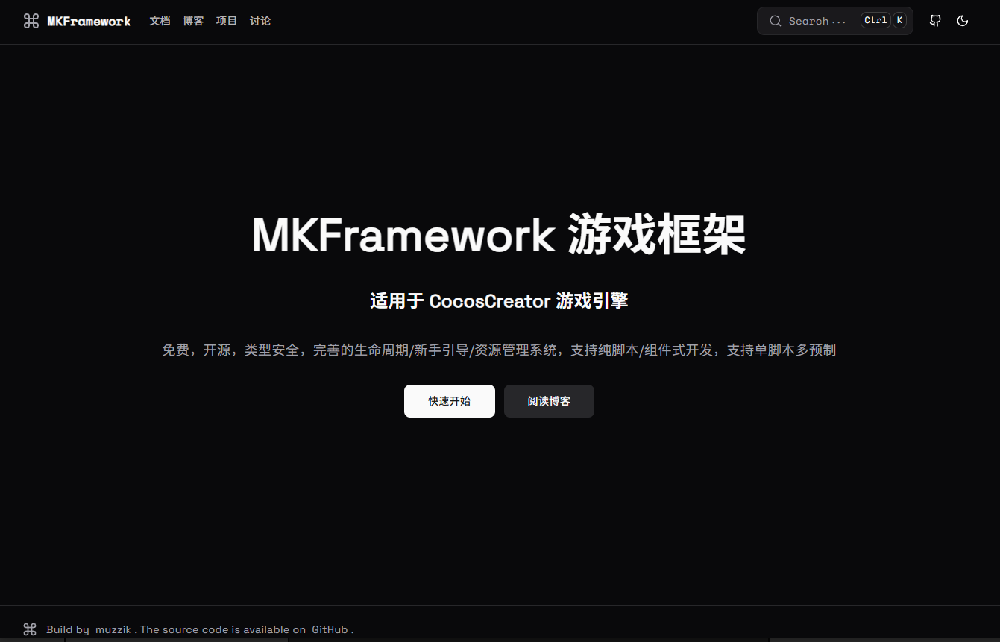
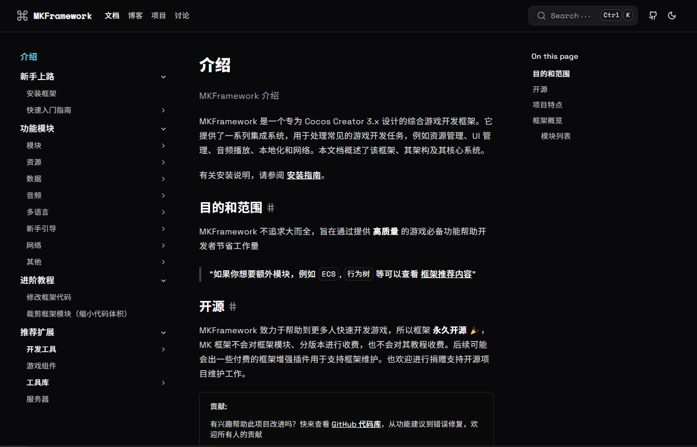

# [MKFramework](https://store.cocos.com/dashboard/detail/6426)

## 📗 框架介绍

MKFramework 是一个专为 Cocos Creator 3.x 设计的综合游戏开发框架。它提供了一系列集成系统，用于处理常见的游戏开发任务，例如资源管理、UI 管理、音频播放、本地化和网络。

🌐 官网地址: <https://mkframework.muzzik.cc>

> 注意：当前仓库为框架的功能示例，对框架功能有疑惑可参考此项目代码学习使用，安装框架可点击下方链接

## 🛠️ 安装框架

<https://mkframework.muzzik.cc/docs/getting-started/install>

## 📣 仓库说明

当前仓库为框架的功能示例集合，对框架功能有疑惑可参考此项目代码学习使用

### ⚙️ 1. 项目初始化

1. 控制台执行 `npm i`

### 🚩 2. 项目导航

> 小提示：参考文档同时查看会更快理解

- 主界面：assets\Main\Scene\Main

- 热更： assets\HotUpdate\Scene

- 音频：assets\resources\Module\Audio

- 新手引导：assets\resources\Module\Guide

- 多语言：assets\resources\Module\Language

- 网络：assets\resources\Module\Network

- 模块
  - 层级控制：assets\resources\Module\Module\LayerControl
  
  - 生命周期：assets\resources\Module\Module\LifeCycle

  - MVC：assets\resources\Module\Module\MVC

  - MVVM：assets\resources\Module\Module\MVVM

  - 独立展示：assets\resources\Module\Module\ShowAlone

  - UI 栈：assets\resources\Module\Module\UIStack

  - 窗口示例集合：assets\resources\Module\Module\Window
